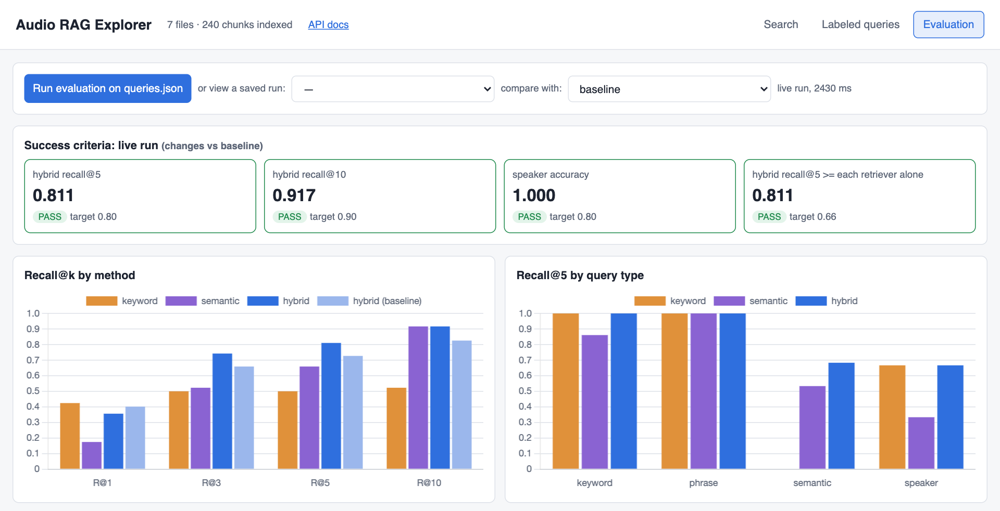
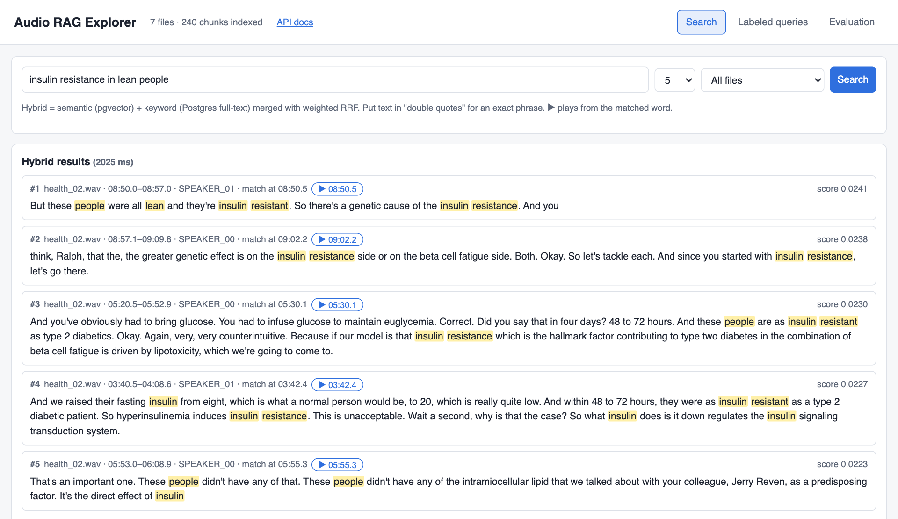
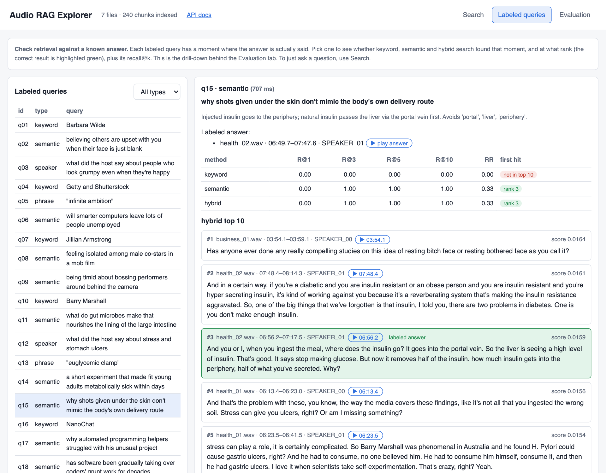
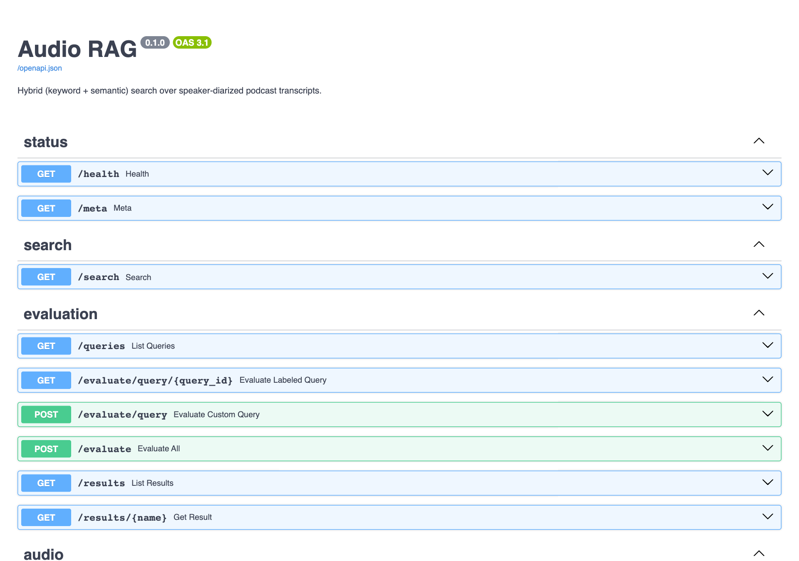

# Audio RAG: Hybrid Search over Speaker-Diarized Audio Transcripts

Submission for the G2 AI Hiring Hackathon, Problem Statement 1 ("Effective retrieval from audio transcripts"). Seven two-speaker podcast clips (8–10 minutes each) are transcribed and diarized with WhisperX, split into speaker-turn chunks, embedded locally with `BAAI/bge-small-en-v1.5`, and stored in Postgres + pgvector. A query runs semantic search (pgvector cosine distance) and keyword search (Postgres full-text search) and merges them with Reciprocal Rank Fusion. Each result shows the file, timestamp, speaker and the turn with matched words highlighted. Retrieval quality is measured as recall@k and MRR against 25 labeled queries.

The full write-up (design, rationale, results, limitations, use of a coding agent) is in [SOLUTION.md](SOLUTION.md).

## Setup

Requirements: Python 3.12 or 3.13 (tested on 3.13), Docker, and ffmpeg (`brew install ffmpeg`; needed only to transcribe audio).

```bash
python3 -m venv .venv && source .venv/bin/activate
pip install -r requirements.txt       # a few minutes: torch + WhisperX
cp .env.example .env                  # defaults work; HF_TOKEN only needed to transcribe
docker compose up -d                  # Postgres + pgvector; schema from db/schema.sql
python -m src.database.connection     # should list both tables, 0 rows
```

If port 5432 is already in use, set another `DB_PORT` in `.env` before `docker compose up -d`.

**Hugging Face token (only to transcribe/diarize audio).** Indexing, search and evaluation work without it, because the transcripts are included. To transcribe:
1. Accept the terms of [pyannote/speaker-diarization-community-1](https://huggingface.co/pyannote/speaker-diarization-community-1) while logged in to Hugging Face.
2. Create a read token at <https://huggingface.co/settings/tokens> and set `HF_TOKEN=` in `.env`.

## Quick start: backend + UI

After the setup above:

```bash
python -m src.index_chunks            # 1. index the included transcripts (~12 s)
uvicorn src.api.app:app --reload      # 2. backend + UI
```

When the server is up you should see:

```
INFO:     Application startup complete.
INFO:     Uvicorn running on http://127.0.0.1:8000 (Press CTRL+C to quit)
```

Then open **http://localhost:8000** for the UI and **http://localhost:8000/docs** for the API. `http://localhost:8000/health` should report `"status": "ok"` and `"total_chunks": 240`. Details, the full endpoint list and the command-line scripts are below.

## Results

Evaluated on 25 labeled queries across all seven clips (22 with a labeled answer, 3 with none). Full analysis in [SOLUTION.md](SOLUTION.md#7-results) and [docs/evaluation.md](docs/evaluation.md).

| Success criterion | Target | Result | Status |
|---|---|---|---|
| Hybrid recall@5 | ≥ 0.80 | **0.811** | ✅ PASS |
| Hybrid recall@10 | ≥ 0.90 | **0.917** | ✅ PASS |
| Speaker accuracy | ≥ 0.80 | 1.000 | ✅ PASS |
| Hybrid recall@5 ≥ each retriever alone | holds | 0.811 vs 0.500 (keyword) / 0.659 (semantic) | ✅ PASS |

**Final results by method:**

| Method | R@1 | R@3 | R@5 | R@10 | MRR |
|---|---|---|---|---|---|
| Keyword (Postgres full-text) | 0.424 | 0.500 | 0.500 | 0.523 | 0.505 |
| Semantic (pgvector) | 0.174 | 0.523 | 0.659 | 0.917 | 0.508 |
| **Hybrid (weighted RRF)** | 0.356 | **0.742** | **0.811** | **0.917** | **0.619** |

**Improvement over the baseline** (BGE query instruction + keyword weight 0.5 in fusion):

| Hybrid | R@1 | R@3 | R@5 | R@10 | MRR |
|---|---|---|---|---|---|
| Baseline | 0.402 | 0.659 | 0.727 | 0.826 | 0.611 |
| Final | 0.356 | 0.742 | 0.811 | 0.917 | 0.619 |

**Hybrid recall@5 by query type:** keyword 1.00 · phrase 1.00 · semantic 0.50 → **0.68** · speaker 0.67. Exact names and phrases are found at rank 1–3; paraphrased questions are the weak spot.



## Layout

```
data/audio/            golden dataset (7 WAV clips); data/dataset.json lists their sources
data/queries.json      25 labeled evaluation queries
docs/evaluation.md     evaluation results, experiment log and known failure modes
db/schema.sql          tables and indexes (applied automatically by docker compose)
output/transcription/  diarized transcripts (included, so indexing needs no GPU)
output/chunks/         speaker-turn chunks
output/eval/           evaluation runs (baseline.json is the frozen baseline)
src/diarization/       WhisperX transcription + diarization
src/chunking/          speaker-turn chunking
src/embeddings/        local embeddings
src/database/          connection and writes
src/retrieval/         hybrid search + CLI
src/api/               web UI + REST API (search, evaluation, audio playback)
src/evaluation/        query validation and recall@k evaluation
src/index_chunks.py    transcripts -> chunks -> embeddings -> Postgres
src/pipeline.py        audio -> transcripts -> ... -> Postgres
tests/                 unit tests for the evaluation maths
```

## Run

### 1. Index

```bash
python -m src.index_chunks            # index the included transcripts (~12 s; no GPU or HF_TOKEN)
python -m src.pipeline                # or run everything from the audio (~12 min per clip on CPU;
                                      # reuses existing transcripts, --force to re-transcribe)
```

### 2. Web UI and API

```bash
uvicorn src.api.app:app --reload      # UI: http://localhost:8000   API docs: http://localhost:8000/docs
```

Needs the database running (`docker compose up -d`) and the index from step 1. The charts load Chart.js from a CDN, so the Evaluation tab needs internet access.

| Tab | What to do |
|---|---|
| **Search** | Ask anything. Hybrid results show file · time · speaker with matched words highlighted; ▶ plays the audio from the matched word. The keyword-only and semantic-only lists are shown underneath. `"quoted text"` is an exact phrase. |
| **Labeled queries** | Pick one of the 25 labeled queries to see whether each method found its known answer and at what rank (correct result in green), with recall@k. **Check your own query** shows each method's results; add the file and time range where you know the answer is said to score it. |
| **Evaluation** | **Run evaluation on queries.json** (~2 s): success criteria, recall@k by method and query type, a per-query table. **Compare with** overlays a saved run, e.g. `baseline`. |






**Endpoints** (try them at `/docs`):

| Endpoint | Returns |
|---|---|
| `GET /search?q=&k=&file=` | Hybrid results plus the keyword-only and semantic-only lists |
| `GET /queries` | The labeled evaluation queries |
| `GET /evaluate/query/{id}` | One labeled query: each method's top 10, which results hit the answer, recall@k |
| `POST /evaluate/query` | The same for your own query, with or without an answer span |
| `POST /evaluate` | Runs all labeled queries: metrics, success criteria, per-query detail |
| `GET /results`, `GET /results/{run}` | Saved evaluation runs (`baseline`, `exp1_…`) |
| `GET /audio/{file}` | The audio clip, with seeking |
| `GET /health`, `GET /meta` | Database status and what is indexed; constants the UI uses |



### 3. Command line

```bash
# Search
python -m src.retrieval.pg_hybrid_search "insulin resistance in lean people"
python -m src.retrieval.pg_hybrid_search '"passive data collection"'   # exact phrase
python -m src.retrieval.pg_hybrid_search                               # interactive

# Evaluate
python -m src.evaluation.validate_queries   # check the labeled queries
python -m src.evaluation.evaluate           # recall@1/3/5/10 and MRR per method -> output/eval/results.json
python -m src.evaluation.report output/eval/results.json --compare output/eval/baseline.json
pytest                                      # unit tests (no database needed)

# Individual stages
python -m src.diarization.diarize [audio]            # transcribe + diarize (needs HF_TOKEN)
python -m src.chunking.chunk [transcript ...]        # speaker-turn chunks
python scripts/build_dataset.py                      # rebuild data/audio/ from data/dataset.json
```
